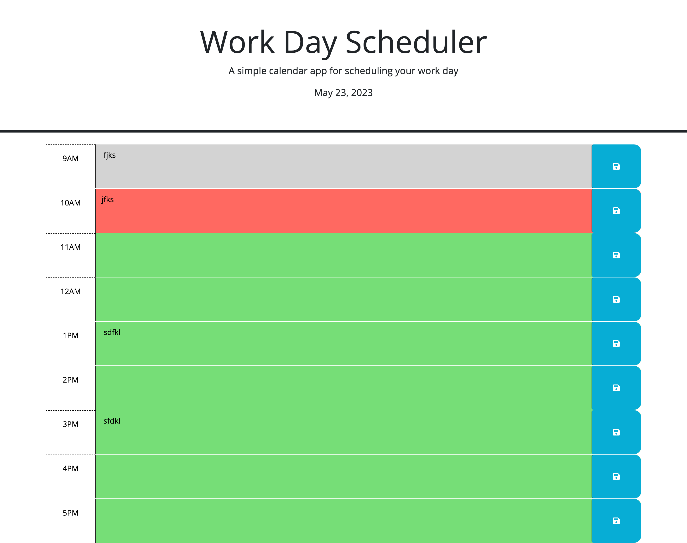

# Work Day Scheduler

## Description
For this project I had to refactor the code for a work day scheduler application to make it function properly. To do this I had to first look at the html and see what elements I needed for my script. Once I got all that figured out I then went to my script and started building my code. First starting with adding a variable for the current hour and then adding a listener for click events on the save button that used the id in the containing time-block as a key to save the user input in local storage. Then I added code to apply the past, present, or future class to each time-block by comparing the id to the current hour. Once I did that I then added code to get any user input that was saved in localStorage and set the values of the corresponding textarea elements. Once that was all done, all that was left to do was add code to display the current date in the header of the page.

## Acceptance Criteria

```md
GIVEN I am using a daily planner to create a schedule
WHEN I open the planner
THEN the current day is displayed at the top of the calendar
WHEN I scroll down
THEN I am presented with timeblocks for standard business hours
WHEN I view the timeblocks for that day
THEN each timeblock is color coded to indicate whether it is in the past, present, or future
WHEN I click into a timeblock
THEN I can enter an event
WHEN I click the save button for that timeblock
THEN the text for that event is saved in local storage
WHEN I refresh the page
THEN the saved events persist
```

## Visual


## Resources

[Deployed Site](https://brady-billeisen.github.io/work-day-scheduler/)

[GitHub Repository](https://github.com/brady-billeisen/work-day-scheduler)

## License
For this project I used an MIT license